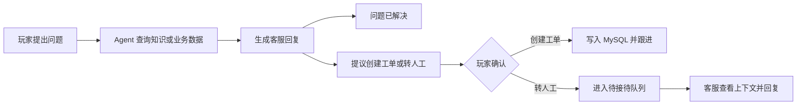
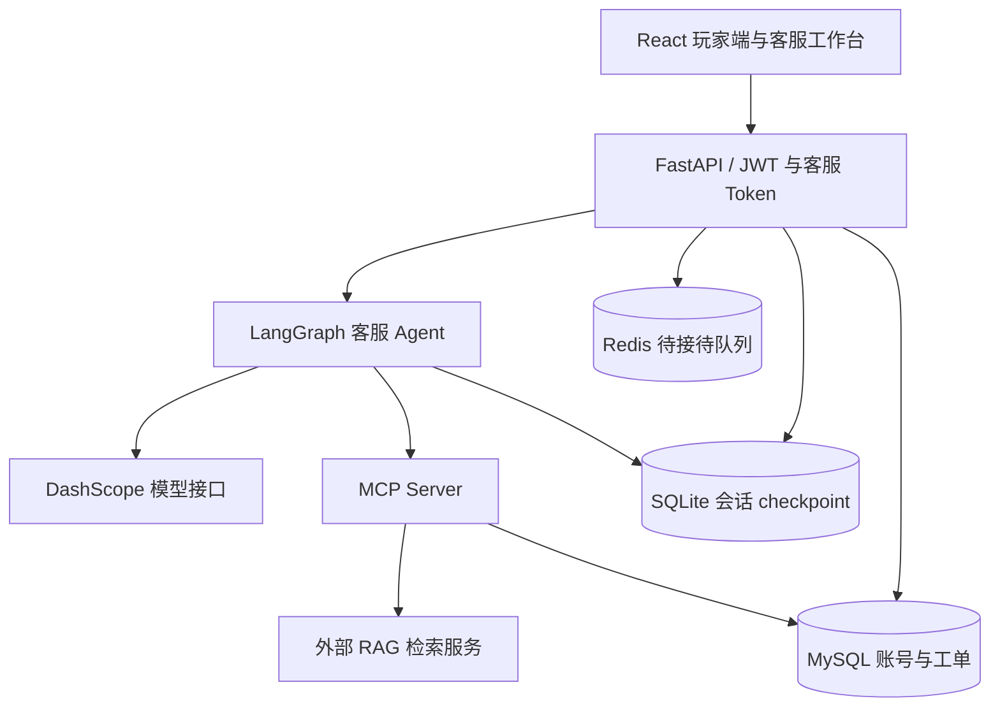

# Game Support Agent · 游戏客服智能体

基于 LangGraph 的游戏客服应用，将知识问答、账号查询、工单确认与人工接待串成完整业务流程。项目包含 Python 后端、React 玩家端与客服工作台，以及覆盖工具调用和多轮对话的评测框架。

**技术栈：** Python · LangGraph · MCP · FastAPI · React · MySQL · Redis · SQLite · RAG

[核心实现](#核心实现与设计取舍) · [系统架构](#系统架构) · [评测结果](#测试与评测) · [快速开始](#快速开始) · [开发文档](docs/development.md)

## 业务场景与功能

玩家咨询往往同时涉及游戏规则、账号状态和需要人工处理的异常。这个项目围绕“查询信息 → 提供回复 → 确认处理方式 → 工单或人工跟进”组织客服流程。

| 场景 | 已实现的处理方式 | 代码入口 |
| --- | --- | --- |
| 知识问答 | 检索知识片段，在 Agent 侧生成回答并校验引用片段 | [RAG 客户端](agent/tools/rag_client.py) |
| 账号与工单查询 | 通过 MCP 工具查询业务数据，供 Agent 组织回复 | [MCP Server](mcp_server.py) |
| 工单创建 | Agent 提出建议，玩家确认后由 API 创建工单 | [确认接口](app/api/v1/chat.py) |
| 人工接待 | 玩家确认转人工，客服在工作台查看上下文并连续回复 | [人工接待接口](app/api/v1/human.py) |
| 多轮对话 | 使用 LangGraph checkpoint 保存会话状态 | [状态持久化](agent/checkpointer.py) |
| 双端交互 | 玩家聊天、工单页面与客服接待、工单管理共用一个前端 | [前端路由](player-chat/src/App.jsx) |

### 可体验的业务流程

下面是流程示意；具体回复由模型、知识库和当前账号数据决定。



本地启动后，可依次体验：在 `/accounts` 选择测试账号 → 询问账号状态或“原石如何获得” → 请求创建工单并确认 → 请求转人工，在 `/admin` 接待。知识演示可使用仓库内的模拟 RAG；它不代表真实检索效果。

## 核心实现与设计取舍

### 1. 用显式状态图组织工具调用

将一次 Agent 执行拆分为 `reasoning → tool_exec → reasoning` 的工具循环，以及 `generate → finish` 的回复阶段。推理节点决定是否调用工具，工具执行节点统一处理结果，最终生成节点负责客服表达。

这样可以分别检查路由、工具结果和回复生成，并通过 `node_trace` 观察执行路径。代价是多阶段模型调用增加时延与成本，最终回复还需要独立检查事实一致性。

**实现：** [状态图](agent/graph.py) · [工具分发](agent/nodes/tool_exec.py) · [Agent 测试](tests/test_agent.py)

### 2. 将操作提议与业务执行分开

创建工单和转人工先产生 `ticket_offer` / `human_offer`，由前端展示确认选项；玩家确认后，后端接口执行对应动作。模型负责提出处理建议，业务接口负责落库或进入接待流程。

这一设计让用户明确选择后续动作，也让确认接口可以单独测试。额外的确认步骤会增加一次交互，需要保持提示文案清晰。

**实现：** [工单提议](agent/tools/propose_ticket.py) · [确认接口](app/api/v1/chat.py) · [工单确认测试](tests/test_chat_ticket_confirm.py)

### 3. 分离知识检索与客服答案生成

外部 RAG 通过 `/api/v1/retrieve` 返回片段、来源和分数；Agent 侧根据片段生成回答，并检查引用文本是否能在来源中匹配。检索错误或无结果会以结构化结果返回，供后续流程处理。

这一接口边界支持替换检索服务，也允许使用模拟服务进行联调。引用匹配只是局部约束，不能证明整段回复都正确；后续润色仍可能引入超出证据的信息，因此评测也检查最终内容。

**实现：** [检索客户端](agent/tools/rag_client.py) · [依据片段作答](agent/tools/knowledge_answer.py) · [RAG 测试](tests/test_rag_client.py)

### 4. 按用途组织会话与业务数据

SQLite 保存 LangGraph 会话状态，Redis 管理待接待队列，MySQL 保存账号和工单。人工回复写入会话 checkpoint，让接待过程可以沿用已有上下文。

这种划分便于本地运行和分别管理数据生命周期；当前方案仍需进一步验证多实例部署、并发接待及跨存储一致性。

**实现：** [checkpoint](agent/checkpointer.py) · [待接待队列](app/services/pending_store.py) · [人工会话](app/services/human_chat.py)

## 系统架构



外部真实检索由配套 [enterprise-rag](https://github.com/cwj-66/enterprise-rag) 仓库提供；本仓库负责客服编排、业务工具、交互界面和 Agent 评测。完整目录结构、接口契约及联合部署见[开发文档](docs/development.md)。

## 测试与评测

采用两层验证：离线单元测试检查状态、接口和评分逻辑；Agent 评测连接实际模型与服务，检查工具行为、人工升级和最终回答。

| 评测类别 | 用例数 | 关注点 |
| --- | ---: | --- |
| 知识问答 | 7 | 检索内容、回答依据与降级行为 |
| 工具调用 | 8 | 账号与工单查询、工具选择 |
| 人工接待 | 7 | 升级触发与禁止操作 |
| 多轮上下文 | 5 | 同一会话中的信息延续 |
| **合计** | **27** | **规则评分 + LLM-as-Judge** |

仓库记录的 **2026-09-27** 评测使用真实 `enterprise-rag`、已入库内部文档及测试账号数据，结果如下。

| 指标 | 记录结果 |
| --- | ---: |
| 综合均分 | **96.44 / 100** |
| 工具调用 / 升级 / 禁止操作 | 各 100 / 100 |
| 内容均分 | 84.81 / 100 |
| 运行错误 / 环境错误 | 0 / 0 |

**结果分析：** 行为评分高于内容评分。已有记录发现，部分回复加入了资料不支持的状态、承诺或步骤，另有确认按钮提示不够明确的问题。后续重点是约束最终回复的事实依据，并扩充失败场景和回归用例。

以上为自建小规模测试集在特定环境下的历史结果，不能解释为生产准确率。原始报告含账号和知识库文本，未公开；公开题目与评分代码可供检查，完整复现还需要对应知识库与环境。现有摘要未完整记录当次模型配置，不以当前默认配置反推历史配置。

**证据入口：** [评测记录](docs/evaluation.md) · [题目与评分代码](eval/) · [单元测试](tests/) · [CI 配置](.github/workflows/ci.yml)

CI 配置覆盖 Python 测试及前端 lint、build，执行状态可在仓库的 [Actions](https://github.com/cwj-66/game-support-agent/actions) 页面查看。

## 快速开始

推荐先体验 **本地 Agent + 模拟 RAG**：仅 MySQL 和 Redis 使用 Docker，Python 服务和前端在本机运行。前置环境为 Python 3.11、Node.js 22.12+（22.x）及 Docker Compose；需准备可用的 DashScope API Key，模型调用会产生费用。

### 1. 安装与配置

```bash
git clone https://github.com/cwj-66/game-support-agent.git
cd game-support-agent
python -m venv venv
```

激活虚拟环境：Windows PowerShell 使用 `./venv/Scripts/Activate.ps1`；macOS / Linux 使用 `source venv/bin/activate`。随后执行：

```bash
python -m pip install -r requirements.txt
```

复制 `.env.example` 为 `.env`，填写 `DASHSCOPE_API_KEY` 和 `GAME_JWT_SECRET`，确认 `REASONING_MODEL_NAME` / `GENERATE_MODEL_NAME` 在账户中可用。其余配置可使用本地演示默认值；当前模型实现使用 DashScope，单独填写 `OPENAI_API_KEY` 不会切换提供方。

### 2. 启动服务

```bash
docker compose up -d mysql redis
```

等待 MySQL 就绪。在三个终端中分别进入仓库根目录、激活虚拟环境，按顺序启动下列服务：

| 终端 | 命令 | 用途 |
| --- | --- | --- |
| 1 | `python -m uvicorn mock_rag.main:app --port 8000` | 模拟知识检索 |
| 2 | `python mcp_server.py` | MCP 工具服务 |
| 3 | `python -m app.main` | 客服 API |

在第四个终端启动前端：

```bash
cd player-chat
npm ci
npm run dev
```

### 3. 体验与验证

- 玩家入口：<http://localhost:5173/accounts>，选择测试账号后进入聊天，页面自动获取玩家 JWT。
- 客服工作台：<http://localhost:5173/admin>。本地默认客服 Token 为 `dev`；若更改后端 `REVIEWER_API_KEY`，需同步设置前端 `VITE_REVIEWER_TOKEN` 并重启 Vite。
- API 文档：<http://localhost:8002/docs>。
- 离线测试：在仓库根目录运行 `python -m pytest -q`。

真实知识检索、Docker 联合部署及模型评测步骤见[开发与部署指南](docs/development.md)。模拟 RAG 仅提供演示片段，不用于复现上面的真实知识库评测结果。

## 当前边界与改进方向

- **运行阶段：** 面向本地开发和演示。完整 Docker 联合构建在既有记录中尚未验证通过，不能视为已完成生产部署。
- **接入方式：** 测试账号登录和前端客服 Token 是演示方案；真实业务接入需要完善身份、权限与密钥管理。
- **回答质量：** 引用校验仍不足以保证最终回复事实一致性，需增加无依据承诺等失败场景的回归验证。
- **性能证据：** 当前未提供并发、P95 延迟和单次请求成本的实测数据，后续需建立相应基线。

## 文档与反馈

- [开发与部署指南](docs/development.md)：目录结构、环境配置、API、RAG 契约与 Docker 联合部署。
- [评测记录](docs/evaluation.md)：历史测试条件、结果与问题分析。
- [问题反馈](https://github.com/cwj-66/game-support-agent/issues)：请附复现步骤、运行方式及脱敏后的错误信息。
